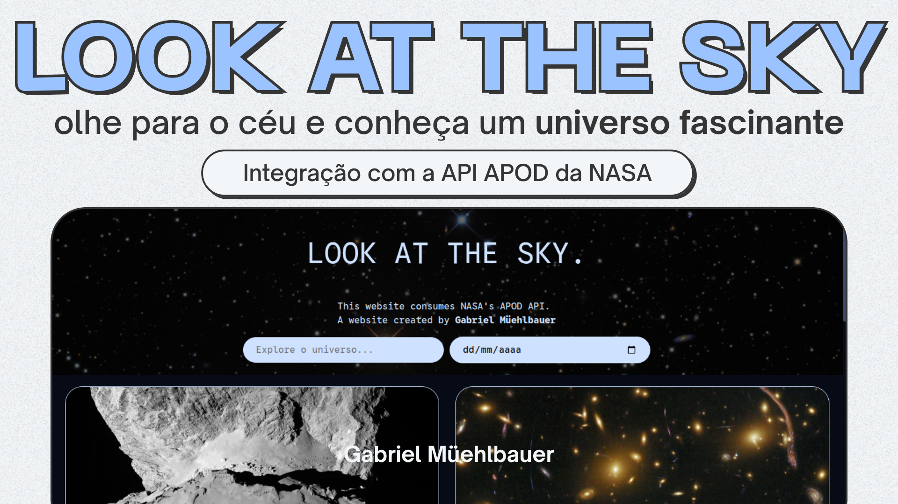

# Look at the Sky 🌌

Uma página web interativa que consome a API pública [APOD (Astronomy Picture of the Day)](https://api.nasa.gov/) da NASA. Este projeto permite que os usuários explorem incríveis imagens do espaço de forma dinâmica, pesquisem por imagens já carregadas e leiam suas respectivas descrições ou histórias.

## 🚀 Tecnologias Utilizadas

* **HTML5:** Estrutura e semântica do site.
* **CSS3:** Estilização visual, layout em grid e janela modal de detalhes.
* **JavaScript (Vanilla):** Lógica da aplicação, consumo da API através da função `fetch`, manipulação do DOM e sistema de filtro de pesquisas.
* **API da NASA (APOD):** Fonte dos dados (títulos, datas, imagens e explicações astronômicas).

## ⚙️ Como executar o projeto na sua máquina

Como este projeto utiliza apenas tecnologias web puras (HTML, CSS e JS), não é necessário instalar pacotes ou servidores complexos. Basta seguir os passos abaixo:

### 1. Obtenha a sua própria chave de API da NASA
Para que o site consiga buscar as imagens, você precisará gerar uma chave gratuita fornecida pela NASA.
1. Acesse o portal oficial de APIs da NASA: https://api.nasa.gov/.
2. Role a página até encontrar a seção **"Generate API Key"**.
3. Preencha o formulário com o seu Primeiro Nome (First Name), Último Nome (Last Name) e E-mail.
4. Clique em "Signup" e copie a **API Key** gerada.

### 2. Baixe o projeto
1. Faça o clone deste repositório ou baixe os arquivos em formato `.zip` clicando no botão **Code -> Download ZIP** aqui no GitHub.
2. Extraia os arquivos para uma pasta de sua preferência no seu computador.

### 3. Configure a sua chave de API no código
1. Navegue até a pasta onde você extraiu os arquivos.
2. Abra o arquivo localizado em `assets/js/app.js` usando o seu editor de texto ou código preferido.
3. Logo no início do arquivo, procure pela constante `API_KEY`.
4. Substitua o valor pelo qual você copiou no Passo 1. Deve ficar parecido com isso:

```javascript
const API_KEY = "COLE_SUA_CHAVE_AQUI";
```
5. Salve o arquivo.

### 4. Explore o universo! 🔭
1. Na pasta principal do projeto, dê um duplo clique no arquivo `index.html`.
2. O site abrirá no seu navegador padrão. Agora é só aguardar as imagens carregarem, rolar a página para clicar nas galáxias e se maravilhar com os detalhes do universo!
